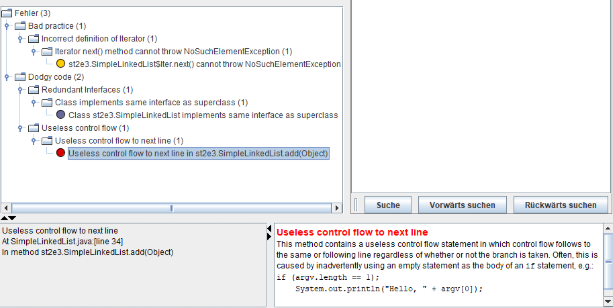
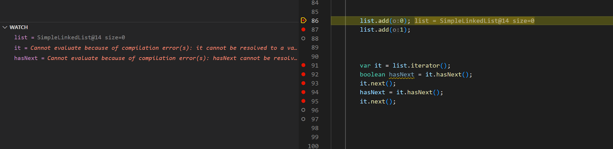
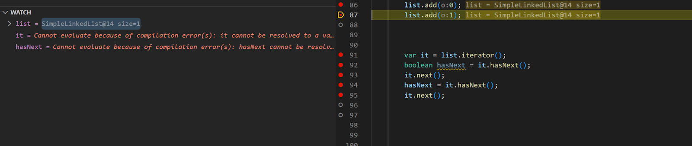
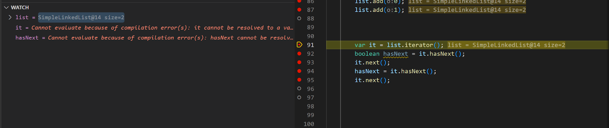
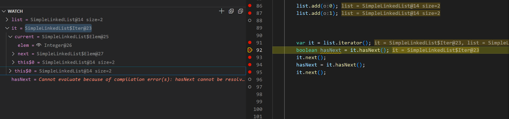
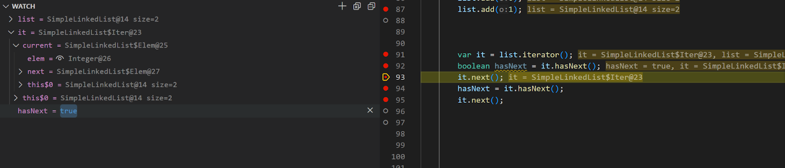
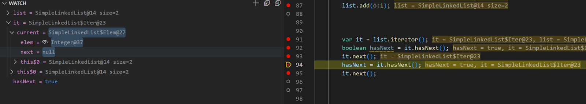
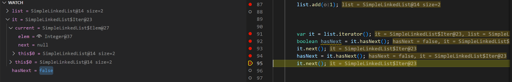

1.
GitHub Repo ist erfolgreich angelegt. Jedes Teammitglied ist eingeladen.

2.
Readme ist erfolgreich angelegt und Schritt 1 und 2 sind nachgetragen.

3.
Wir mussten erstmal Maven installieren. Dies geschah indem wir die apache-maven-3.9.9-bin.zip runterluden, diese entpacken und den bin ordner in die Systemvariablen PATH hinzu.
Visual Studio bot eine automatische Funktion beim umwandeln der standalone Java Datei in ein Maven Projekt. Diese nutzen wir ;)
Um das Projekt zu kompelieren nutzen wir folgenden Befehl:
```cmd
mvn compile
```
Um den Testvorgang anzustoßen werden wir folgenden Befehl nutzen:
```cmd
mvn test compile
```
4.
Wir haben eine dependencies für AssertJ und drei für JUnit 5 hinzugefügt, um flüssiges Testen zu ermöglichen und Assertions schreiben zu können
Ebenfalls haben wir uns dazu entschieden, für ein konstantes Testen zum Build-Cycle hinzuzufügen, dass automatisch getestet wird. Das heißt, dass bei folgendem Befehl auch gleichzeitig getestet wird:
```cmd
mvn package
```

5. 
Wir haben uns mit EclEmma und JaCoCo vertraut gemacht und herausgefunden, dass es sich um ein gemeinsames Plugin handelt, welches die Codeabdeckung des Programms trackt und Feedback dazu gibt. Wir haben uns in Visual Studio Code die Extension "Koverage" installiert, um die JaCoCo Auswertung im IDE zu sehen. Außerdem kann man die Auswertung auf einer ausgegebenen html Website anzeigen. 
Um JaCoCo in Maven zu konfigurieren haben wir ein weiteres Plugin hinzugefügt. 

Die Art der Codeabdeckung bei JaCoCo ist einerseits die Line-Coverage (Linienabdeckung) die einzelne Zeilen überprüft und die Branch-Coverage, die zudem auch einzelne if/else-Statements abdecken kann. Man kann JaCoCo in dem Sinne der Ergebnisausgabe konfigurieren, wir haben uns wie oben genannt für eine html basirte Ausgabe entschieden.

6. 
Wir haben eine weitere dependency für die JUnit TestSuite hinzugefügteine TestSuite erstellt und die Testklassen implementiert. Außerdem haben wir getestet ob der command "mvn compile" uns ausgibt, dass die Tests fehlschlagen, was sich bewahrheitete.

Als dann alles aufgestellt war und wir nach einiger Hilfestellung auch Feedback für unsere Tests bekommen haben, haben wir uns mit dem richtigen Schreiben dieser beschäftigt.

Als wir die Tests zum Laufen gebracht haben ist uns zunächst aufgefallen, dass die SimpleLinkedList Klasse teilweise falsch ist. So gab es zunächst Probleme mit der add-Funktion, welche wir relativ schnell fixen konnten. Danach waren von 6 geschriebenen Tests schon 4 richtig. Die weiteren gaben uns Probleme bei der hasNext-Funktion, welche wir auch nochmal ausbessern mussten. Schlussendlich gab es nur noch Probleme damit, dass current null sein konnte, was immer wieder NullpointerExeptions gab. Nachdem verhindert wurde, dass der Fehler auftritt, indem current nicht mehr null werden konnte, haben alle Tests geklappt.

7. Um Spotbugs zu nutzen fügten wir es in die pom.xml Datei hinzu.  

Spotbugs hat uns 3 Fehler angezeigt: Iterator.next() soll wenn es kein nächstes Element gibt, eine NoSuchElementExeption werfen. Außerdem hat SimpleLinkedList Collection<E> implementiert, was aber bereits durch AbstractCollection<E> implementiert wurde. Zuletzt wird noch ein nutzloser Control Flow markiert in der Methode add, dank der Beschreibung wird deutlich, dass hier ein If-Statement seinen Zweck nicht erfüllt.  Wir haben alles behoben und nun zeigt Spotbugs 0 Fehler an. Der Java compiler hat uns allerdings wenig geholfen, da wir mit Informationen regelrecht überladen wurden, und er zu jedem Plugin und Dependency mehrere Zeilen debug code ausspuckte.


9. Wir haben zuerst eine Main-Funktion geschrieben, damit das Debuggen überhaupt mödlich war.


Im ersten Bild ist zu sehen, dass wir eine Liste erstellt haben und diese noch leer ist. Siehe Variable list, size=0.


Im zweiten Bild ist zu sehen, dass ein Element der Liste hinzugefügt wurde (siehe list, size=1) 


Im dritten Bild ist zu sehen, dass ein zweites Element der Liste hinzugefügt wurde (siehe list, size=2)


Im 4.Bild sieht man, dass wir einen Iterator erstellt haben und dieser unter der Variable "it" angezeigt wird.


Im 5. Bild sieht man, dass wir mit i.hasNext() testen, ob der Iterator, welcher aktuell auf unserem ersten Element liegt, auch registriert, dass es ein weiteres gibt, auf der nächten Stelle. Da dieser true anzeigt stimmt das.


Im 6. Bild ist zu segen, dass die Variable next, welche wir testen null anzeigt. Dies geschieht da unser Debug-Breakpoint auf dem zweiten und somit letzten Element angekommen ist und es kein weiteres gibt. HasNext ist immer noch auf "true" gesetzt das wir es erst in der nächsten Zeile updaten/überschreiben. Siehe Bild 7. es wird dann auf "false" gesetzt

